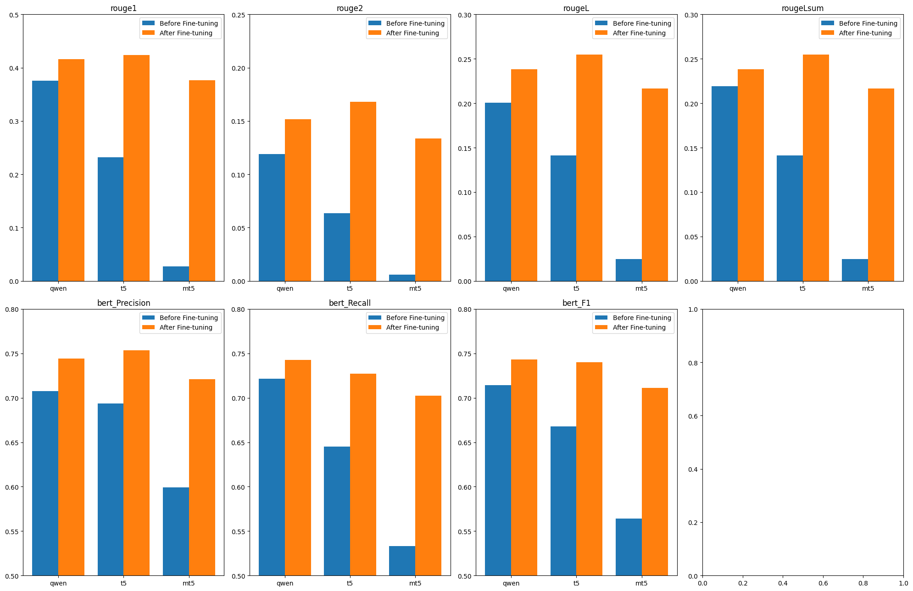

# SMALL LANGUAGE MODEL FINETUNING FOR SUMMARIZATION
Gabriel Mercier & Ayoub Melliti

### Written report

- [Small_Language_Model_Finetuning_for_Summarization.pdf](Small_Langage_Model_Finetuning_for_Summarization.pdf)

End-to-end pipeline to generate a French summarization dataset with Qwen2.5-32B-Instruct, then fine-tune lightweight models (T5-base, mT5-base, Qwen-0.5B) using LoRA (4-bit quantization, r = 8–128). We compare decoder-only vs encoder–decoder architectures, analyze LoRA rank/target layers, and report ROUGE and BERTScore improvements within ≤ 16 GB VRAM.

March 14th, 2025

# Code description
## `data_generation` folder : 

 

- notebook `generate_dataset.ipynb` used to generate the file `dataset_llm_generated.json` with Qwen2.5-32B-instruct. 

- `postprocess_dataset.ipynb` Post processes the dataset and splits int into train, validation and test dataset in `dataset_split`.

## Finetuning-Code :
- `t5.ipynb` Is a notebook which contains the code to finetune mT5 on the dataset, and evaluate it
- `t5.py` Contains the same code, and is used to run the finetuning and evaluation togerther with tmux.

- same purpose for`qwen.ipynb`, `qwen.py`.
- The code for finetuning mT5 is the same as T5. The only change needed is the variable `model_name`

## `result` folder :

### `model_evaluation`folder : 
Contains the performance comparison between the 3 models, raw and finetuned with LoRA $r = 16$.

### `finetuning_lora_results` folder : 
Contains the performance comparison between LoRA configurations (rank and target modules varying) for T5 only.

- `figure_rank` for the rank comparison.
- `figure_target_modules` for the target module comparison.

### `training information_results` folder :
Contains training data such as loss function values, training times, parameters percentages.

